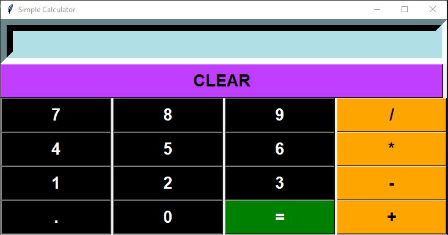

# Simple Python Calculator

## NOTES:

This is a simple calculator.\
If error happens, ERROR will be displayed in the screen.\
Text in the display can be modified.\
You can continuously do operation in this calculator, one after other.

## GUI Image

